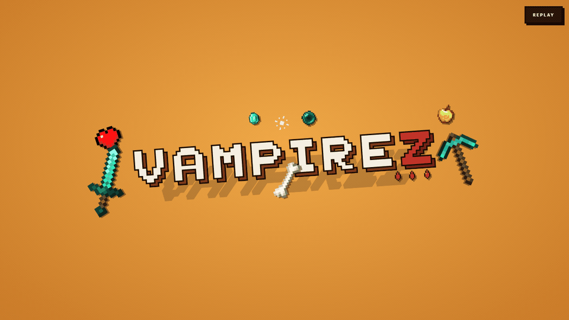

<p align="center">
  
</p>

# VampireZ

A Minecraft minigame plugin where **Humans survive against Vampires** for 25 minutes. Dead humans convert into vampires — the last surviving human wins the round, or the vampires do if they wipe everyone out.

Built for **Spigot / Paper 1.20.1** with Java 17.

> 📖 Full game mechanics, damage math, and the complete 145-perk catalogue live in the **[Wiki](WIKI.md)**.

---

## Features at a glance

- Two asymmetric teams — Humans (iron + bows) vs Vampires (leather + leap)
- **145 unique perks** across Silver / Gold / Prismatic tiers
- Gold economy (passive income, kill & assist rewards)
- Day / Night cycle with vampire-specific buffs and debuffs
- Perk shop GUI with random roll selection
- Free timed perks at 5 / 10 / 15 min
- Multi-server safe — full inventory isolation, crash-safe saves
- Clickable event broadcasts with `/vz announce`

---

## Installation

### Quick install (pre-built)

1. Download `VampireZ-1.0.0.jar` from the [Releases](../../releases) page.
2. Drop it into your server's `plugins/` folder.
3. Start or restart the server.
4. (Optional) Download `VampireZ-Map.zip` and extract the `world` folder into your server directory.

### Build from source

Requires **Java 17** and **Maven**.

```bash
mvn clean package
```

The built JAR lands at `target/VampireZ-1.0.0.jar`. Copy it into `plugins/`.

---

## First-Time Setup

Spawns persist in `config.yml`, so this is a **one-time** setup per server:

1. `/vz arena` — teleport to the arena world.
2. Walk to the lobby area → `/vz setlobby`.
3. Walk to the human spawn → `/vz sethumanspawn`.
4. Walk to the vampire spawn → `/vz setvampspawn`.

---

## Running an Event

1. `/vz announce` — broadcasts a clickable join message to every online player.
2. Players click the message or type `/vz join` to enter the lobby.
3. `/vz start` once enough players have joined (or `/vz forcestart` to bypass the minimum).

When the game ends — or when a player types `/vz leave` — their full inventory, location, XP, health, and game mode are restored exactly as they were before joining.

### Disconnect behaviour

- A human who disconnects mid-game is auto-converted to vampire.
- Reconnecting mid-game rejoins them as a vampire with auto-assigned perks.
- If the game ends before they reconnect, their original inventory is restored on next login.
- Inventories are written to disk before join, so a server crash won't lose them.

---

## Commands

| Command | Permission | Description |
|---------|-----------|-------------|
| `/vz join` | — | Join the VampireZ lobby |
| `/vz leave` | — | Leave and restore your inventory |
| `/vz shop` | — | Open perk shop |
| `/vz perks` | — | List your active perks |
| `/vz gold` | — | Show gold balance |
| `/vz status` | — | Game state and team counts |
| `/vz announce` | `vampirez.admin` | Broadcast join message |
| `/vz start` | `vampirez.admin` | Start game |
| `/vz forcestart` | `vampirez.admin` | Start ignoring player count |
| `/vz stop` | `vampirez.admin` | Stop running game |
| `/vz setlobby` / `sethumanspawn` / `setvampspawn` | `vampirez.admin` | Set spawns |
| `/vz arena` | `vampirez.admin` | Teleport to arena |
| `/vz test` | `vampirez.admin` | Open perk test menu |
| `/vz reload` | `vampirez.admin` | Reload config (lobby only) |

Full reference in the [Wiki](WIKI.md#commands-reference).

---

## Configuration

Settings live in `plugins/VampireZ/config.yml` after first run. Common tweaks:

| Key | Default | Meaning |
|-----|--------:|---------|
| `game.min-players` | 10 | Minimum to start |
| `game.game-duration-seconds` | 1500 | Round length (25 min) |
| `game.vampire-ratio` | 0.3 | Starting vampire fraction |
| `economy.kill-reward` | 15 | Gold for a kill |
| `economy.assist-reward` | 5 | Gold per assist |
| `perks.max-perks-per-player` | 4 | Perk slot cap |

The full schema and tuning tips are in the [Wiki → Configuration](WIKI.md#configuration-reference).

---

## Requirements

- Spigot or Paper 1.20.1+
- Java 17+

---

## Documentation

- **[WIKI.md](WIKI.md)** — game flow, damage formula, perk system, full 145-perk catalogue, day/night math, economy math, configuration reference, arena map.

---

## License

Open source — use, modify, and learn from it.
