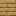
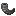
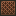

<p align="center">
  
</p>

# VampireZ Wiki

Everything behind the curtain: game flow, combat math, economy, day/night, perk interactions, and the full 145-perk catalogue.

For install & usage, see the [README](README.md).

---

## Table of Contents

1. [Game Flow](#game-flow)
2. [Combat System](#combat-system)
3. [Economy](#economy)
4. [Day / Night Cycle](#day--night-cycle)
5. [Teams & Conversion](#teams--conversion)
6. [Gear Loadouts](#gear-loadouts)
7. [Perk System](#perk-system)
8. [Full Perk Catalogue](#full-perk-catalogue)
9. [Commands Reference](#commands-reference)
10. [Configuration Reference](#configuration-reference)
11. [Arena Map](#arena-map)

---

## Game Flow

The game lives in a single state machine: `LOBBY → STARTING → ACTIVE → ENDING → LOBBY`.

### LOBBY
- Players join via `/vz join` or clicking the broadcast from `/vz announce`.
- The lobby scoreboard shows current / minimum players.
- No combat, no perks, no gear — just holding area.

### STARTING (15 s countdown)
- Announcements at **10, 5, 4, 3, 2, 1 s**.
- Teams assigned: `vampireCount = max(1, round(players × 0.3))`.
- Players teleported to human / vampire spawns and given starting gear.
- A free **Silver** perk selection opens 1 s after the game starts (20 ticks).

### ACTIVE (25 minutes / 1500 s)
| Timer | Event |
|-------|-------|
| every 10 s | +2 gold passive income to every player |
| 5:00 elapsed | Free perk pick — **random tier** (roll animation + 3 perk choices) |
| 10:00 elapsed | Free perk pick — **random tier** |
| 15:00 elapsed | Free perk pick — **random tier** |
| 5:00 / 1:00 / 0:30 remaining | Milestone broadcast |
| last 5 s | Final countdown |

The day/night cycle also runs during this phase — see [below](#day--night-cycle).

### Win Conditions
- **Humans win** when the 25-min timer reaches 0.
- **Vampires win** when the human team is empty (everyone converted).

### ENDING
- Win broadcast, fireworks, 10 s wind-down.
- Every player’s **original inventory, location, XP, health, food, potion effects, and game mode** are restored — see [Teams & Conversion](#teams--conversion) for crash-safety details.

---

## Combat System

VampireZ replaces vanilla PvP damage with a custom formula to keep fights tactical and stop perks from stacking into one-shot combos.

A sword or axe in the main hand is required for the custom formula to trigger — bare-fist hits fall back to vanilla damage (usually 1 HP).

### Step 1 — Base damage

$$
\text{base} = \begin{cases} 5.0 \text{ HP} & \text{attacker is Human} \\ 4.0 \text{ HP} & \text{attacker is Vampire} \end{cases}
$$

### Step 2 — Weapon material bonus

Added to the base before any scaling.

$$
\text{material bonus} = \begin{cases}
+0.0 & \text{Wood, Stone, Gold, Iron} \\
+0.5 & \text{Diamond} \\
+1.0 & \text{Netherite}
\end{cases}
$$

### Step 3 — Sharpness enchantment

$$
\text{sharpness bonus} = 0.5 \times \text{sharpness level}
$$

### Step 4 — Attack-cooldown scaling

The attack cooldown is a value from 0 (just-swung) to 1 (fully recharged).

$$
\text{raw damage} = (\text{base} + \text{material bonus} + \text{sharpness bonus}) \times \text{cooldown}
$$

Spamming clicks sends cooldown toward 0, so raw damage shrinks with it — a fully recharged hit is worth ten spammed hits.

### Step 5 — Armor reduction (at 30 % strength)

Vanilla Minecraft reduces damage aggressively through armor. VampireZ keeps only **30 %** of that effect so iron armor stays meaningful without trivialising attacks.

$$
\text{armor reduction} = \min\left(\frac{\text{armor points}}{25},\ 0.80\right)
$$

$$
\text{after armor} = \text{raw damage} \times (1 - \text{armor reduction} \times 0.30)
$$

> *Example:* Full Iron armor = 20 armor points. Vanilla would reduce damage by 80 %. Here we keep 30 % of that → **24 % reduction**.

### Step 6 — Protection enchantment

Each level of Protection on any armor piece reduces damage by 4 %, capped at 80 %.

$$
\text{protection reduction} = \min\left(0.04 \times \sum \text{Protection levels},\ 0.80\right)
$$

$$
\text{final base} = \text{after armor} \times (1 - \text{protection reduction})
$$

> *Example:* Full Iron with Protection I on every piece = `4 × 4 % = 16 %` further reduction.

### Step 7 — Perk modifiers (in order)

Perks layer on top of the base damage. The order matters because some are multiplicative and others additive:

$$
\begin{aligned}
\text{d}_1 &= \text{final base} &\text{(attacker's own perks adjust first)} \\
\text{d}_2 &= \text{d}_1 &\text{(then victim's defensive perks)} \\
\text{d}_3 &= \text{d}_2 \times 1.10 &\text{if attacker has War Drums aura} \\
\text{d}_4 &= \text{d}_3 + 2.0 &\text{if attacker has Bard damage aura} \\
\text{d}_5 &= \text{d}_4 \times (1 + 0.05 \cdot \text{cleaver stacks}) &\text{up to } \times 1.25 \\
\text{d}_6 &= \text{d}_5 \times \text{anvil multiplier} &\text{if any}
\end{aligned}
$$

### Step 8 — Damage cap (7 HP)

After every modifier, damage is clamped so no combo can one-shot:

$$
\text{damage} = \min(\text{d}_6,\ 7.0 \text{ HP})
$$

### Step 9 — Special weapons

If the attacker's sword has a special post-processing buff (Nether Blade at max tier), that multiplier is applied *after* the cap, then the cap is re-enforced:

$$
\text{damage} = \min(\text{damage} \times \text{special mult},\ 7.0 \text{ HP})
$$

### Other combat rules
- **Friendly fire** is cancelled before damage is calculated.
- **Fall damage** is negated entirely if any owned perk grants fall immunity.
- **Hidden armor** (Phantom Step, Bat Form) still counts — invisible vampires don't become glass.
- **Curse of Decay** reduces all healing the cursed player receives by 50 %.

---

## Economy

| Source | Amount | Cadence |
|--------|-------:|---------|
| Passive income | **+2 g** | Every 10 s (200 ticks) |
| Kill | **+15 g** | On kill — killer only |
| Assist | **+5 g** | Per assister within 10 s damage window |

### Perk costs
| Tier | Cost |
|------|-----:|
| Silver | 50 g |
| Gold | 150 g |
| Prismatic | 400 g |

### Armor repair
25 g via the shop GUI — restores durability on all armor pieces.

### Assist tracking
Every time a player takes damage, the attacker is remembered for a rolling **10-second window**. When that player dies, everyone who hit them in the window — except the final killer — earns the assist reward.

---

## Day / Night Cycle

| Phase | Duration | World time | Vampire effect |
|-------|---------:|-----------:|----------------|
| Day | 7200 ticks (6 min) | 1000 | **Slowness I** |
| Night | 4800 ticks (4 min) | 13000 | **Speed I** |

- The cycle starts on **Day** the moment the game begins.
- Transitions broadcast a message + sound to the whole arena.
- Effects are re-applied on respawn, conversion, and phase change so they never drop.

---

## Teams & Conversion

### Starting ratio

$$
\text{vampire count} = \max(1,\ \text{round}(\text{players} \times 0.30))
$$

10 players → 3 vampires, 7 humans. Picks are randomised each game.

### Human death → Vampire conversion
1. On death: drops cleared, death message suppressed.
2. Kill rewards distributed (+15 g to the killer, +5 g to each assister).
3. The player moves from the human team to the vampire team.
4. **All Human-only perks are removed** from their loadout.
5. After a 2-second delay: vampire gear given, remaining perks re-applied, day/night effect re-applied.
6. For every perk that got stripped, a free **Vampire perk selection** GUI opens so they can pick a replacement.

### Vampire respawn
1. Death plays the "vampire cackle" sound.
2. After 80 ticks (4 s): teleport to vampire spawn, restore gear, re-apply perks and day/night effect.

### Disconnect handling
- If a human disconnects mid-game they're auto-converted to vampire — no advantage from rage-quitting.
- A reconnecting vampire is restored with gear and has missing perk slots auto-assigned.
- Inventories are written to disk before join (**crash-safe**) and restored on leave / game end / next login.

### Multi-server isolation
- Perk effects, gold income, scoreboards, and broadcasts are scoped to players **inside** the VampireZ instance.
- Day/night, block protection, and mob targeting rules only apply in the arena world.
- Player inventory / XP / health / hunger / potion effects / game mode are saved and restored per-join.

---

## Gear Loadouts

### Human
| Slot | Item | Enchants |
|:---:|------|----------|
| 0 | Iron Sword | Sharpness I |
| 1 | Bow | — |
| 2 | Golden Apple × 3 | — |
| 3 | Cooked Beef × 12 | — |
| 4 | Arrow × 24 | — |
| 8 | Emerald "Perk Shop" | right-click to open |
| Helmet | Iron Helmet | Protection I |
| Chest | Iron Chestplate | Protection I |
| Legs | Iron Leggings | Protection I |
| Boots | Iron Boots | Protection I |

### Vampire
| Slot | Item | Notes |
|:---:|------|-------|
| 0 | Stone Sword | — |
| 1 | Rotten Flesh × 8 | — |
| 2 | Ghast Tear "Vampire Leap" | right-click, 8 s cooldown |
| 8 | Emerald "Perk Shop" | right-click to open |
| Helmet | Custom "Vampire" Player Head | unbreakable, skin texture `16b76d73…c5cf5c` |
| Chest / Legs / Boots | Black-dyed Leather | unbreakable |
| Effect | Night Vision | permanent (999999 ticks) |

---

## Perk System

### Tiers & Teams
- **Tiers:** Silver (50 g), Gold (150 g), Prismatic (400 g).
- **Teams:** Human-only, Vampire-only, or Both — the perk pool you see is filtered by your current team.
- **Max per player:** 4 slots by default.

### Selection flow
When you earn a pick (free or purchased), the system rolls **3 random perks** from the chosen tier — filtered to your team and excluding anything you already own. Clicking one:
1. Deducts the gold cost (if you bought it).
2. Grants the perk immediately — potion effects, items, enchantments, and everything else are applied on the spot.
3. Slots it into your active perk list for the rest of the game.

### Free perk timers
Everyone automatically gets a free **roll** at set times. The only guaranteed tier is the one at game start — every later roll **rolls its tier randomly too**, shown with a slot-machine animation before the GUI opens.

| Time | What you get |
|------|--------------|
| Game start | Silver (guaranteed) + 3 random Silver perks to pick from |
| 5:00 elapsed | **Random tier** (Silver / Gold / Prismatic) + 3 random perks of that tier |
| 10:00 elapsed | **Random tier** + 3 random perks of that tier |
| 15:00 elapsed | **Random tier** + 3 random perks of that tier |

So you might luck into a Prismatic at the 5-minute mark, or roll three Silvers back-to-back — it's all up to the dice.

If a player closes the selection GUI, it re-opens up to 3 times; after that a random qualifying perk from that rolled tier is auto-assigned so slots are never wasted.

### Admin perk test menu
`/vz test` opens a paginated browser of every perk — click to toggle on yourself, with a "Clear All" button. Only works in the lobby and for players with `vampirez.admin`.

---

## Full Perk Catalogue

**Team key:** 🔵 Human only · 🔴 Vampire only · ⚪ Both teams


### Silver Tier (50 perks · 50 g)


| Icon | Team | Perk | Effect |
|:----:|:----:|------|--------|
|  | ⚪ | Blunt Force | +20 % melee damage |
|  | ⚪ | Deft | Permanent Speed I |
|  | ⚪ | Heavy Hitter | +4 % of max HP as bonus damage per hit |
|  | ⚪ | Goredrink | 15 % lifesteal on damage dealt |
|  | ⚪ | Escape Plan (Weak) | Below 4 ♥: Speed I + Absorption I for 3 s (30 s cd) |
|  | ⚪ | Vitality | +2 max hearts |
|  | ⚪ | Tough Skin | −10 % damage taken |
|  | ⚪ | Swift Strikes | +15 % attack speed |
|  | ⚪ | Dash | Right-click Feather to dash forward (5 s cd) |
|  | ⚪ | Lightweight | Jump Boost I + no fall damage |
|  | ⚪ | Second Wind | Regen I when below 50 % HP |
|  | ⚪ | Adrenaline Rush | Taking damage grants Speed I for 3 s |
|  | ⚪ | Riposte | After being hit, next attack within 3 s deals +40 % |
|  | ⚪ | Flame Arrows | Bow gets Flame I |
|  | ⚪ | Momentum | Consecutive hits within 3 s stack +8 % dmg (max +24 %) |
|  | ⚪ | Gravity Well | Melee hits pull target 1 block toward you (3 s cd) |
|  | ⚪ | Supply Drop | Every 90 s: chest with 2 golden apples + 8 arrows (15 s) |
|  | ⚪ | Scaling | Stats scale up as game progresses |
|  | ⚪ | Black Shield | Block next perk ability used against you |
|  | ⚪ | Trail | Sprinting trail: allies Speed I, enemies Slowness I |
|  | ⚪ | Combo Shield | Every 4th hit taken is negated |
|  | ⚪ | Haste | Permanent Haste I |
|  | ⚪ | Sunder | Attacks reduce victim's armor for 5 s |
|  | ⚪ | Regenerative | Permanent slow health regen |
|  | ⚪ | Headhunter | Bonus damage to targets above 80 % HP |
|  | ⚪ | Lucky Roll (Silver) | Replaces itself with a random Gold perk |
|  | 🔵 | First-Aid Kit | +30 % healing received |
|  | 🔵 | Buff Buddies | Allies within 10 blocks get Resistance I |
|  | 🔵 | Steady Aim | +20 % projectile damage |
|  | 🔵 | Iron Wall | Gives Shield item to block attacks |
|  | 🔵 | Thorns | Reflect 10 % melee damage to attacker |
|  | 🔵 | Archer's Quiver | Infinity + Power I bow |
|  | 🔵 | Deflect | 30 % chance to negate projectile damage |
|  | 🔵 | Fortify | Crouching grants Resistance I |
|  | 🔵 | Guardian's Oath | −15 % damage taken when ally within 5 blocks |
|  | 🔵 | Wolf Pack | On vampire kill: summon 2 wolves (8 s) |
|  | 🔵 | Sharpness Boost | Sword upgraded to Sharpness II |
|  | 🔵 | Protection Boost | All armor upgraded to Protection II |
|  | 🔵 | Arrow Supply | +16 extra arrows (40 total) |
|  | 🔵 | Healing Potions | 3 Instant Health potions, regen 1 every 2 min |
|  | 🔵 | Fire Aspect | Sword gets Fire Aspect I |
|  | 🔵 | Speed Potions | 3 Speed potions, regen 1 every 2 min |
|  | 🔵 | Rally Cry | On kill: nearby allies get Speed I + Regen I for 4 s |
|  | 🔵 | Natural Leader | Glow effect, +1 g / 3 s per nearby human, 1 %/s Regen |
|  | 🔵 | Cooker | Every 60 s, feed nearby humans +2 saturation |
|  | 🔵 | Medic | 3 healing snowballs, regen 1 every 15 s |
|  | 🔵 | Heavyweight | Double max HP |
|  | 🔵 | Porcupine | Attackers take thorns damage and knockback |
|  | 🔵 | War Drums | Nearby allies deal +10 % damage |
|  | 🔵 | Fortune Teller | Reveal the next free perk tier on scoreboard |
|  | 🔴 | Homeguard | Speed III for 5 s on respawn |
|  | 🔴 | Dive Bomber | On death: explode 4 ♥ to enemies within 4 blocks |
|  | 🔴 | Scavenger | Kills drop a Golden Apple |
|  | 🔴 | Backstab | +30 % damage when hitting from behind |
|  | 🔴 | Bloodlust | Each kill grants +1 max ♥ (up to +3) |
|  | 🔴 | Poison Fang | Attacks apply Poison I for 3 s |
|  | 🔴 | Pack Hunter | +10 % dmg per ally within 6 blocks of target (max +30 %) |
|  | 🔴 | Bone Armor | First hit every 12 s reduced by 50 % |
|  | 🔴 | Leech Swarm | On death: spawn 3 silverfish (5 s) |
|  | 🔴 | Undead Horde | Every 30 s: spawn 2 zombies (10 s) |
|  | 🔴 | Blood Scent | Enemies below 50 % HP glow through walls |
|  | 🔴 | Feral Charge | Sprinting attacks deal +30 % damage (6 s cd) |
|  | 🔴 | Infectious Bite | On kill: heal nearby vampires for 4 ♥ |

### Gold Tier (49 perks · 150 g)


| Icon | Team | Perk | Effect |
|:----:|:----:|------|--------|
|  | ⚪ | Celestial Body | +4 max ♥, −10 % damage dealt |
|  | ⚪ | Executioner | +30 % damage to targets below 40 % HP |
|  | ⚪ | Get Excited | On kill: Speed II + Strength I for 6 s |
|  | ⚪ | It's Critical | 30 % chance for 1.5× damage |
|  | ⚪ | Berserker | Below 30 % HP: Strength I + Speed I |
|  | ⚪ | Smoke Bomb | Right-click: Blindness AoE for 5 s (20 s cd) |
|  | ⚪ | Ender Pearl Supply | 3 Ender Pearls, regen 1 every 30 s |
|  | ⚪ | Iron Rations | +8 cooked beef + 2 golden apples |
|  | ⚪ | Last Stand | Below 25 % HP: knockback-immune + 25 % more dmg |
|  | ⚪ | Siphon | Melee hit steals 1 ♥ (8 s cd per target) |
|  | ⚪ | Heartsteal | Nearby hit for 5 s+: permanent +0.5 max ♥ (60 s cd) |
|  | ⚪ | Black Cleaver | Each hit shreds 5 % armor (max 25 %, 10 s) |
|  | ⚪ | Bounty Hunter | Kills grant +15 bonus gold |
|  | ⚪ | Whirlwind | Right-click: 3 ♥ AoE (12 s cd) |
|  | ⚪ | Life Link | Ally within 15 blocks: both get +2 bonus ♥ |
|  | ⚪ | Selfish | +gold from kills, no assist gold to allies |
|  | ⚪ | Gore Drinker | Lifesteal scales with missing HP |
|  | ⚪ | War Horse | Permanent speed + mount-style charge damage |
|  | ⚪ | Lucky Roll (Gold) | Replaces itself with a random Prismatic perk |
|  | ⚪ | Nether Blade | 5-tier upgradable wooden sword; max tier = healing dash |
|  | 🔵 | Dawnbringer's Resolve | Auto-regen 1 ♥ / 2 s when below 4 ♥ |
|  | 🔵 | All For You | Splash healing potions heal 50 % more |
|  | 🔵 | Armored Up | Armor upgraded to Diamond |
|  | 🔵 | Phoenix Down | One-time auto-revive at half HP |
|  | 🔵 | Crossbow Expert | Crossbow with Quick Charge II + Piercing |
|  | 🔵 | Mirror Shield | 20 % chance negate + reflect damage |
|  | 🔵 | Golden Guard | Fatal damage: spend 30 g to survive at 2 ♥ |
|  | 🔵 | Barricade | Right-click: 3-wide glass wall for 5 s (25 s cd) |
|  | 🔵 | Power Shot | Bow gets Power I |
|  | 🔵 | Blast Shield | Armor gets Blast Protection II |
|  | 🔵 | Strength Potions | 3 Strength potions, regen 1 every 2 min |
|  | 🔵 | Golden Feast | +3 extra Golden Apples (6 total) |
|  | 🔵 | Knockback | Sword gets Knockback I |
|  | 🔵 | Chain Armor | Leather armor → Chainmail |
|  | 🔵 | Poison Quiver | 8 Poison arrows, regen 1 every 10 s |
|  | 🔵 | Consecrated Ground | Right-click: holy zone heals / damages (40 s cd) |
|  | 🔵 | Martyr | On death: nearby allies heal 4 ♥ + Absorption II |
|  | 🔵 | Shield | Right-click sword: 3 absorption ♥ for 4 s (45 s cd) |
|  | 🔵 | Sunfire Cape | Melee attackers get set on fire |
|  | 🔵 | Ricochet Shot | Arrows bounce to a second nearby target |
|  | 🔵 | Overcharge | Charged bow shots deal bonus damage |
|  | 🔵 | Always Connected | Reveal all humans + heal 1 ♥ each (45 s cd) |
|  | 🔵 | Fight or be Forgotten | Fatal: 30 s invuln then convert to vampire |
|  | 🔵 | Long Bow | +1 % arrow dmg per block (cap +50 %); 75+ blocks = instakill |
|  | 🔴 | Blunt Force II | +20 % melee damage (stacks with Silver) |
|  | 🔴 | Shadow Strike | Teleport behind nearest enemy (15 s cd) |
|  | 🔴 | Frost Bite | Attacks apply Slowness I + Frost Walker boots |
|  | 🔴 | Phantom Step | After taking damage: 2 s invis + Speed I (15 s cd) |
|  | 🔴 | Blood Price | Sacrifice 3 ♥, next hit 2× (20 s cd) |
|  | 🔴 | Tether | Pull nearest enemy toward you (15 s cd) |
|  | 🔴 | Skeleton Archers | Every 30 s: spawn 2 archers (10 s) |
|  | 🔴 | Harming Potions | 3 Splash Harming potions, regen 1 every 2 min |
|  | 🔴 | Hemophilia | Attacks bleed: 0.5 ♥/s for 4 s |
|  | 🔴 | Nocturnal | Night: +2 ♥ + 15 % dmg; Day: −1 ♥ |
|  | 🔴 | Corpse Explosion | On kill: victim explodes, 3 ♥ AoE |
|  | 🔴 | Blood Beacon | Place healing beacon for nearby vampires (60 s cd) |
|  | 🔴 | Shadow Ambush | 3 s invis, next hit +50 % damage (30 s cd) |
|  | 🔴 | Spider Climb | Wall climbing ability |
|  | 🔴 | Plague Carrier | Spread poison to nearby enemies over time |

### Prismatic Tier (45 perks · 400 g)


| Icon | Team | Perk | Effect |
|:----:|:----:|------|--------|
|  | ⚪ | Can't Touch This | Every 30 s: 8 s invulnerability |
|  | ⚪ | Glass Cannon | −30 % max HP, +35 % damage dealt |
|  | ⚪ | Goliath | +6 max ♥, +10 % damage, Slowness I |
|  | ⚪ | Thunderstrike | Every 5th hit summons lightning |
|  | ⚪ | Earthquake | Right-click: 6-block AoE knockback + 3 ♥ (30 s cd) |
|  | ⚪ | Chain Lightning | Melee hits chain for 50 % damage |
|  | ⚪ | Death's Gambit | Fatal: 50/50 survive at 1 HP or take 50 % more |
|  | ⚪ | Plague Doctor | Immune to all negative potion effects |
|  | ⚪ | Decoy | Spawn a decoy of yourself |
|  | ⚪ | Lucky Roll (Prismatic) | Replaces itself with 2 random Prismatic perks |
|  | ⚪ | Galeforce | 4-tier upgradable bow; max tier = dash + regen |
|  | 🔵 | Courage of the Colossus | Hit a player → 2 absorption ♥ (30 s cd) |
|  | 🔵 | Escape Plan (Strong) | Below 4 ♥: Absorption III + Speed II for 5 s (45 s cd) |
|  | 🔵 | Giant Slayer | Speed I + 25 % dmg to targets with more max HP |
|  | 🔵 | Netherite Arsenal | Netherite Sword + Helmet + Chestplate |
|  | 🔵 | Guardian Angel | Auto-revive 50 % HP + 5 s invuln (3 min cd) |
|  | 🔵 | Trapper | 5 placeable cobwebs |
|  | 🔵 | Marksman | Power III + Punch I bow, 32 arrows |
|  | 🔵 | Citadel | 5-block zone: Resistance I + Regen I for allies (60 s cd) |
|  | 🔵 | Holy Shield | Absorb 10 dmg → auto-explode 4 ♥ AoE |
|  | 🔵 | Temporal Shield | Freeze enemies within 5 blocks for 2 s (45 s cd) |
|  | 🔵 | Iron Guardian | On vampire kill: summon Iron Golem (12 s) |
|  | 🔵 | Diamond Edge | Iron sword → Diamond (Sharpness I) |
|  | 🔵 | Thorns Enchant | All armor gets Thorns II + Unbreaking III |
|  | 🔵 | Regeneration Potions | 3 Regen potions, regen 1 every 2 min |
|  | 🔵 | Radiant Aura | Enemies within 6 blocks take 1 ♥/3 s + Glowing |
|  | 🔵 | Time Warp | Fatal: rewind to position + HP from 3 s ago (90 s cd) |
|  | 🔵 | Bard | Aura buffs nearby allies |
|  | 🔵 | Plant Master | Vines + plants slow and damage enemies |
|  | 🔵 | Dimensional Pocket | Store items across lives |
|  | 🔴 | Erosion | Hits apply Weakness I for 3 s |
|  | 🔴 | Final Form | Every 60 s: Absorption IV + 25 % lifesteal for 8 s |
|  | 🔴 | Firebrand | Sets target on fire + 0.5 ♥ bonus damage |
|  | 🔴 | Double Tap | Crits deal 1.75× + Slowness I |
|  | 🔴 | Bat Form | Invisible + Speed III for 5 s (25 s cd) |
|  | 🔴 | Soul Eater | Each kill grants +10 % permanent damage (max +30 %) |
|  | 🔴 | Summoner | Summon 2 wolves to attack (45 s cd) |
|  | 🔴 | Void Walker | Teleport to random enemy + 3 ♥ AoE (25 s cd) |
|  | 🔴 | Reaper's Mark | Mark enemy +20 % dmg, kill within 30 s = full heal (45 s cd) |
|  | 🔴 | Wither Guard | Every 30 s: spawn 2 wither skeletons (12 s) |
|  | 🔴 | Blood Moon | Allies: Speed I + 20 % lifesteal for 8 s (90 s cd) |
|  | 🔴 | Wraith Walk | 4 s ghost form, expiry AoE Blindness + Slow (35 s cd) |
|  | 🔴 | Curse of Decay | Attacks curse enemies: 50 % reduced healing for 6 s |

---

## Commands Reference

| Command | Permission | Description |
|---------|-----------|-------------|
| `/vz help` | — | Show command list |
| `/vz join` | — | Join the VampireZ lobby |
| `/vz leave` | — | Leave and restore your inventory |
| `/vz shop` | — | Open perk shop (active game only) |
| `/vz perks` | — | List your active perks |
| `/vz gold` | — | Show gold balance |
| `/vz status` | — | Game state, time, team counts |
| `/vz announce` | `vampirez.admin` | Broadcast clickable join message |
| `/vz start` | `vampirez.admin` | Start game (checks min players + spawns) |
| `/vz forcestart` | `vampirez.admin` | Start ignoring player count |
| `/vz stop` | `vampirez.admin` | Stop running game |
| `/vz setlobby` | `vampirez.admin` | Set lobby spawn |
| `/vz sethumanspawn` | `vampirez.admin` | Set human spawn |
| `/vz setvampspawn` | `vampirez.admin` | Set vampire spawn |
| `/vz arena` | `vampirez.admin` | Teleport to arena world |
| `/vz test` | `vampirez.admin` | Open perk test menu |
| `/vz reload` | `vampirez.admin` | Reload config (lobby only) |

---

## Configuration Reference

All settings live in `plugins/VampireZ/config.yml` after first run.

```yaml
game:
  min-players: 10
  game-duration-seconds: 1500          # 25 minutes
  vampire-ratio: 0.3                   # 30 % become vampires
  vampire-respawn-delay-ticks: 80      # 4 seconds
  lobby-countdown-seconds: 30
  start-countdown-seconds: 15

economy:
  passive-income-amount: 2
  passive-income-interval-ticks: 200   # 10 seconds
  kill-reward: 15
  assist-reward: 5
  assist-time-window-ms: 10000         # 10 seconds

perks:
  max-perks-per-player: 6              # Note: effective cap is 4
  silver-cost: 50
  gold-cost: 150
  prismatic-cost: 400
  options-per-purchase: 3

day-night:
  enabled: true
  day-duration-ticks: 7200             # 6 minutes
  night-duration-ticks: 4800           # 4 minutes

spawns:
  lobby:   { world, x, y, z, yaw, pitch }
  human:   { world, x, y, z, yaw, pitch }
  vampire: { world, x, y, z, yaw, pitch }

messages:
  prefix: "&8[&4VampireZ&8] "
  game-start, vampires-win, humans-win, human-death, night-fall, day-break
```

### Useful tweaks
- **Shorter games for testing:** drop `game-duration-seconds` to 120 and `min-players` to 2.
- **Vampire-heavy games:** bump `vampire-ratio` to 0.4 – 0.5.
- **Bigger perk pools:** raise `max-perks-per-player`. Note: the effective cap is 4 unless you also change the hard-coded limit in the source.

---

## Arena Map

<p align="center">
  
</p>

The bundled map is distributed as `VampireZ-Map.zip` — extract into your server directory alongside `world/`, then set spawns with `/vz setlobby`, `/vz sethumanspawn`, `/vz setvampspawn`.